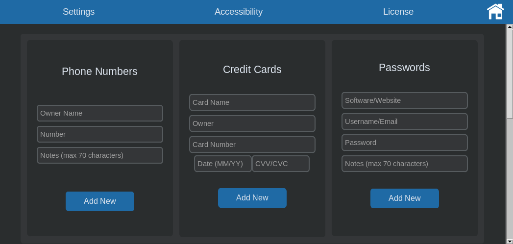
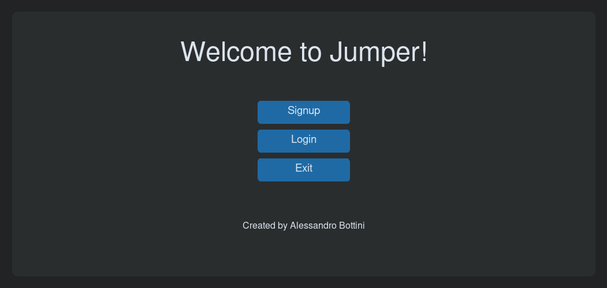
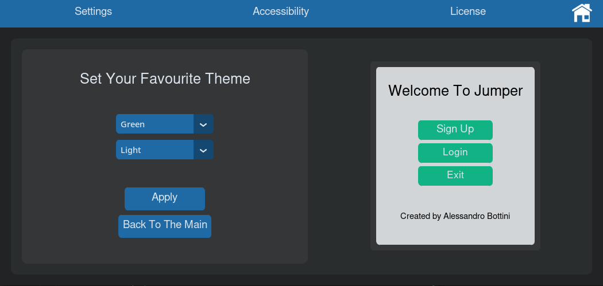
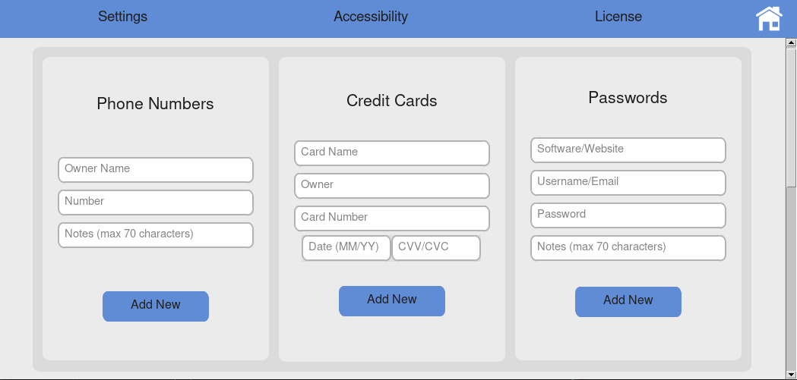
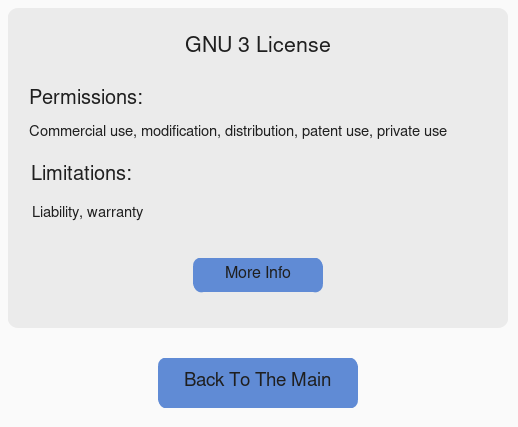

[](https://github.com/alessandro-bottini/Jumper)
[](https://github.com/alessandro-bottini/Jumper)
[](https://github.com/alessandro-bottini/Jumper)
[](https://github.com/alessandro-bottini/Jumper)
# Jumper 🐇 (still under development)
Jumper is a well made data manager for phone numbers, credit cards and passwords made with Python.
This is actually my first programming project; when I started to develope it I spent 3 months to finish it but one week ago I decided to make it public, so I wrote it again with a better code and I implemented a really nice graphic user interface. Usability: ***Linux***, ***Windows*** & ***macOS***.



`images/image1.png`


## Linux Installation
Clone the repository:
```
git clone https://github.com/alessandro-bottini/Jumper.git
```
Open the directory
```
cd Jumper
```
Install the requirements
```
pip install -r requirements.txt
```
Open the code folder
```
cd src
```
Install tkinter (***command depends on your distribution***)

Run the main.py file
```
python3 main.py
```


## Windows Installation
* *Download the zip file*
* *Extract **every** file inside the zip*
* *Open the new folder **Jumper** in the terminal*
* *Run this command:* ```pip install -r requirements.txt```
* *Open the **src** folder and run **main.py***


## Warning
Don't move or delete **any** file from ```/Jumper/src```. Else the program won't start anymore.


## Database security
All the data that you save using the software is stored in a sqlite3 database (`/src/data.db`).
To make it inaccessible to malicious users, it's encrypted with a private rsa key before being sent to the database. In fact, two asymmetric keys are used for the encryption, you can find them in the `/src/keys.py` file. To change the default keys just run this code and replace them with the new output:

```py
import rsa

public, private = rsa.newkeys(512)
print(public, private)
```


## More images and videos


`images/video.gif` | *Sign up window*
<br><br><br>


`images/image2.png` | *Menu window*
<br><br><br>


`images/image3.png` | *Accessibility window*
<br><br><br>


`images/image4.png` | *Main window*
<br><br><br>


`images/image5.png` | *License window*
